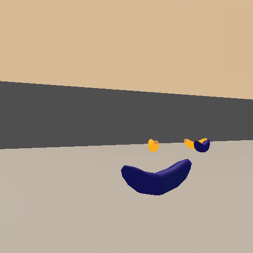
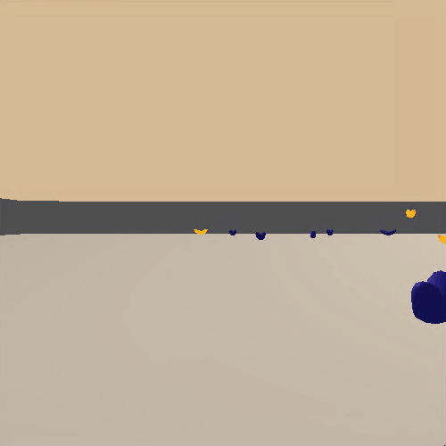

# The Banana Project
Deep Reinforcement Learning - Udacity Project # 1

The goal of this project is tu use a [Deep Q Network algorithm](https://www.cs.toronto.edu/~vmnih/docs/dqn.pdf) architecture in order to train an agent to play the Banana game provided in the [Deep Reinforcement Learning](https://www.udacity.com/course/deep-reinforcement-learning-nanodegree--nd893?utm_source=gsem_brand&utm_medium=ads_n&utm_campaign=2045115106_c&utm_term=77922608568_nam&utm_keyword=deep%20reinforcement%20learning%20udacity_e&gclid=EAIaIQobChMI_7_j6NWj5QIVhZ-zCh1z-wS1EAAYAiAAEgLjp_D_BwE) Udacity course.

The final model will finally use the advantages of a [Double Q Learning](https://arxiv.org/abs/1509.06461) architecture.

The game is a simple 3D area (built using [Unity Machine Learning Agents](https://unity3d.com/machine-learning)) where the player can choose between 4 actions (move forward/backward, turn left/right) to collect yellow Bananas (reward of +1) and avoid blue Bananas (reward of -1).

### The Game

Possible Actions:

- 0 - move forward.
- 1 - move backward.
- 2 - turn left.
- 3 - turn right.

The task is episodic and the task is considered succeeded if the agent gets an average score of +13 over 100 consecutive episodes.

### Setting up the environment

This environment has been built using [Unity Machine Learning Agents](https://unity3d.com/machine-learning). The environment can be downloaded using one of the following links:
- [Linux](https://s3-us-west-1.amazonaws.com/udacity-drlnd/P1/Banana/Banana_Linux.zip)
- [Mac OSX](https://s3-us-west-1.amazonaws.com/udacity-drlnd/P1/Banana/Banana.app.zip)
- [Windows (32-bit)](https://s3-us-west-1.amazonaws.com/udacity-drlnd/P1/Banana/Banana_Windows_x86.zip)
- [Windows (64-bit](https://s3-us-west-1.amazonaws.com/udacity-drlnd/P1/Banana/Banana_Windows_x86_64.zip)

Main required librairies:                

| Library | Version |
| :--------|--------:|
| matplotlib | 3.1.1|
| numpy | 1.17.2 |
| python | 3.6.7 |
| pytorch | 1.3.0 |

## The Solution

For this problem, an RNN has been used in order to have an idea of the movement in the 3D area. 

<i>Note : </i> This wouldn't be necessary for that problem since the only movements are from the agent itself (therefore known action) and Bananas falling from the sky (always falling exactly along the same axis), but I've been able to achieve fair results using a Gated Recurrent Unit and stayed with this architecture in order to be ready for more complexed data. For example in the original DQN paper, 4 frames have been used before the CNN to let the model have a sense of the movements. 

### The main files

| Files | Description |
| :--------|:--------|
| Report.ipynb | The main Jupyter Notebook to train and test the agent |
| models.py | Contains the RNN model used by the agent to model the Q function |
| dqn_agent.py | Contains the double Q learning agent |
| train_dqn.py | Implement the function to train the DQN agent  |

### The Untrained Agent

### The Trained Agent

## Ideas for Future Work

Even if the model successfully gets an average reward of +13 over 100 consecutive episodes, in some of those episodes the agent gets stuck in loops. Indeed, if on a given state the reward is to go in a direction and the next best action in that new state (according to the model) is to go back to the previous position, the agent can get stuck between those 2 postions.

If the epsilon (random action probability) is higher than 0, then the agent will eventually get out of this cycle, but this isn't efficient.

Here are some ideas of future work that could be considered to avoid or minimize the occurences of those situations:
1. Have another model guess/imagine what will be the next action in the next state and if this action would reverse the previous, try the second best one.
2. Have a last action memory and if the next action would reverse the previous one, try the second best one.
3. Add noise to the output action in order to sometime select another one than the best while avoiding the worst one. For example adding a 5% noise on the model output before the argmax function.
